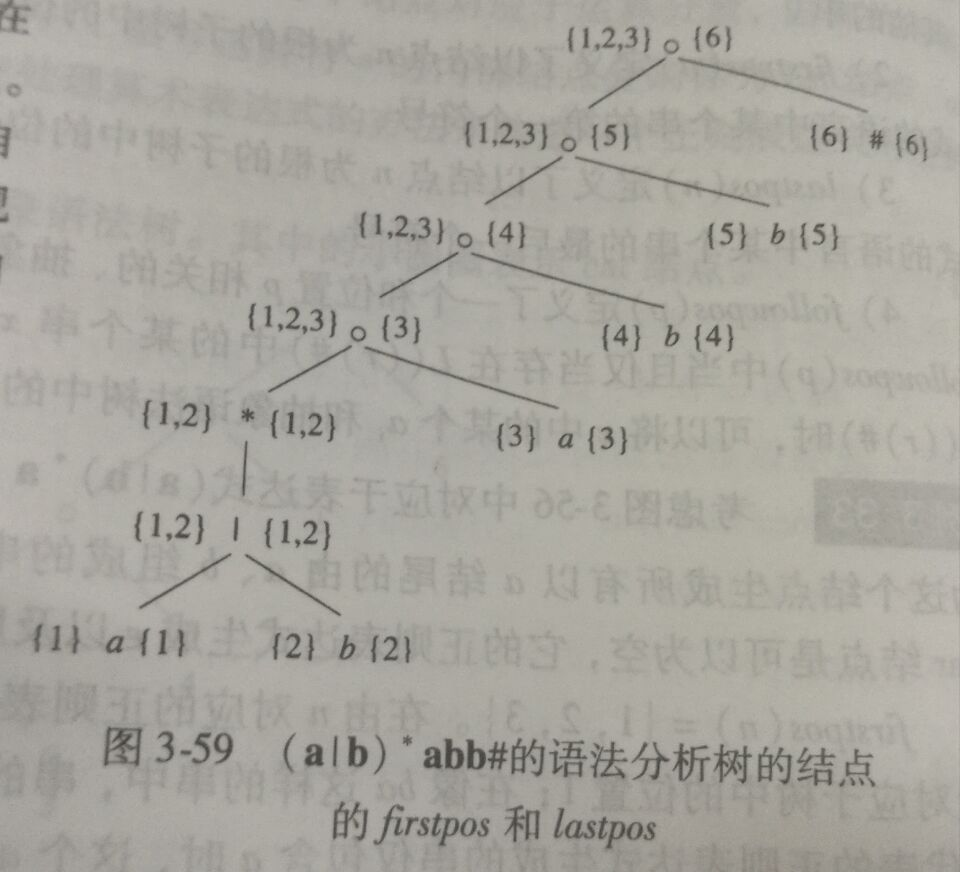
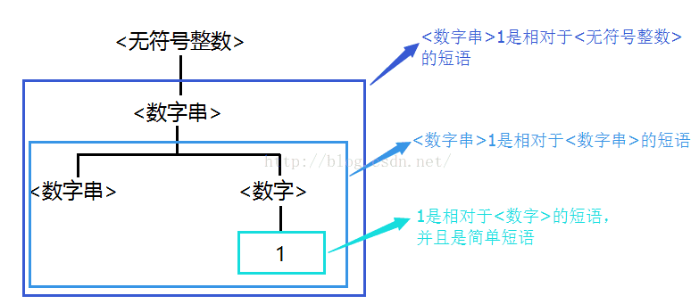
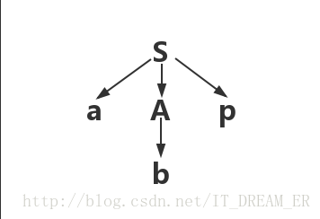
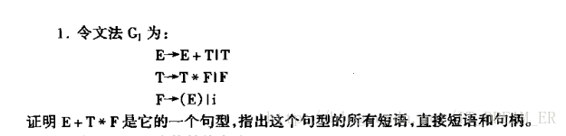
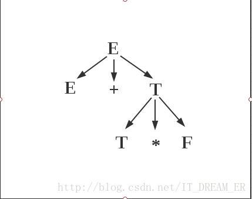
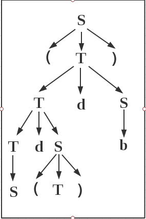
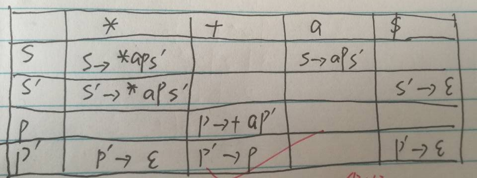

## 编译原理复习知识点

### 1. 串&&语言&&正则表达式：

> #### 1. 串：
> 
> 该字母表中符号构成的有穷**序列**，用|s|表示
> 
> > #### 串的操作：
> > 
> > 1. 串的连接：xy，把两个串连接起来
> > 
> > 2. 串的幂：s^n = sss...s (n个s)
> 
> #### 2.语言（L(G)）：
> 
> 字母表上的一个**串集(集合)**，属于该语言的串又称该语言的句子，或者是文法G构成的句子的集合，即**由该文法G生成的语言**
> 
> > #### 语言的操作：
> > 
> > 1. L ∪ M = {s | s ∈ L and s ∈ M}
> > 
> > 2. L连接M = {st| s ∈ L , t ∈ M}
> > 
> > 3. L^0 = {e}
> 
> #### 3. 正则表达式：
> 
> > #### 正则表达式的操作：(待补充......)
> > 
> > 1. a* : 0或多个a
> > 
> > 2. a? : 0或1个a
> > 
> > 3. \[abcd...z] : a|b|c|...|z
> > 
> > 4. \[a-z] : \[abcd...z] 
> > 
> > 5. \[^xyz] 负值字符集合。匹配未包含的任意字符
> > 
> > 6. \[^a-z] 负值字符范围。匹配任何不在指定范围内的任意字符
> > 
> > 7. {n} n是一个非负整数，匹配确定的n次
> > 
> > 8. {n,} n是一个非负整数。至少匹配n次
> > 
> > 9. \d 匹配一个数字
> > 
> > 10. \w 匹配一个字母或数字
> > 
> > 11. \s 匹配一个空格（也包括Tab等空白符）

### 2.词法单元，模式，词素

> 1. 词法单元
> 
> > 由**记号**和**属性值**构成的**二元组**
> 
> 2. 模式
> 
> > 用于描述该记号的词法单元形式
> 
> 3. 词素
>    
>    > 也就是**单词**
>    > 
>    > 源程序中匹配一个词法单元的**字符序列**

### 3. NFA&&DFA

> ### 1.NFA（不确定的有穷自动机）
> 
> > 一个NFA由以下几个部分组成：
> > 
> > 1. 一个有穷的状态集合S
> > 
> > 2. 一个输入符号集合Σ ，即输入字母表，假设空串e不是Σ中的元素
> > 
> > 3. 一个转换函数，它为每个状态Σ ∪ |e| 中的每个符号都给出了相应的后继状态的集合
> > 
> > 4. S中的一个状态S0被指定为**开始状态** ，或者是**初始状态**
> > 
> > 5. S的一个子集F被指定为**接受状态（或者终止状态）**集合
> > 
> > 即一个五元组：（状态集S，输入符号表Σ，转换函数，初态，终态集）
> > 
> > #### NFA与DFA区别：
> > 
> > > 当一个状态面对一个输入符号时，它所转换到的可能不只一个状态，且初态可以不唯一
> 
> ### 2.DFA
> 
> > 一个确定的有穷自动机M是一个**五元组**：（状态集，输入符号表，转换函数，惟一的一个初态，终态集）
> 
> ### 3. NFA&&DFA 转换：
> 
> > **对于每个NFA ∈ M，都存在一个DFA ∈ N，使得L(M) = L(N)**。对于任何两个（确定的&&非确定的）有穷自动机M和N，**如果L(M) = L(N)，则称M与N是等价的**。
> > 
> > #### 转换方法：子集构造法
> > 
> > > 定义两个运算：
> > > 
> > > 1. 状态集合I的ε-闭包，表示为ε-closure(I)，定义为一状态集，是状态集I中任何状态S经任意条ε弧而能到达的状态的集合。显然I属于ε-closure(I)。
> > > 
> > > 2. 状态集合I的a弧转换，表示为move(I, a)，定义为状态集合J，其中J是所有那些可以从I中的某一状态经过一条a弧而到达的状态全体。
> > 
> > #### DFA化简：
> > 
> > [一个题](QQ图片20190421093747.jpg)

> 由正则表达式直接生成DFA

步骤： 
1. 往正则表达式后面加一个符号#，然后设置Nullable, FirstPos, LastPos, FollowPos, 构建抽象语法树 \
抽象语法树构造：分为以下几个符号：连接(cat) ，| ，* \
然后构造一颗树...... \
像这样 

2. 它顺便把FirstPos和LastPos也写了出来，具体FirstPos和LastPos求法，参考FIRST集合求法... 
3. 然后是求FollowPos集合 \
咋求呢？ 
   1. 对于**每个cat节点**，把右子树的FirstPos中的全部元素，分别加到左子树的LastPos中的每个集合中 
   2. 对于**每个star节点**，往该节点中的每个LastPos中的位置加入FirstPos中的每个元素
4. 开始构造DFA
   1. 将根节点的FirstPos设为开始状态集合A
   2. 然后move(A,a) = FollowPos(i) if 状态i  = B , move(A,b) = C ......同理上面DFA不再多说
   3. 然后当包含了#的时候，所有状态完成，DFA构造完毕

### 4.句型，句子，句柄，短语，简单短语：

> ### 句柄：
> 
> > 直接短语中的**最左直接短语为该句型的句柄**  
> 
> ### 直接短语：
> 
> >  如果**子树中不再包含其他的子树**，即A只能推导出b，而b不能再推出其他的式子，则b为此句型的直接短语
> 
> ### 短语：
> 
> > **一个句型的语法树中任一子树叶结点所组成的符号串都是该句型的短语**, aAp是短语，b也是短语
> 
> #### 句型&&句子：
> 
> > 由文法产生式推导出来的式子，若仅由终结符组成则成为句子

#### 一个小练习：

> 如何证明是句型？ 只需要画出抽象语法树
> 
>  所以，E + T * F 为一个句型
> 
> 短语：E + T * F , T * F
> 
> 直接短语： T * F 
> 
> 句柄：T * F

#### 另一个小练习：

> 短语：S , (T) , Sd(T), b, Sd(T)db, (Sd(T)db) 
> 
> 直接短语： S, (T), b
> 
> 句柄：S

### 5.上下文无关文法：

> 由四个元素构成：
> 
> 1. **一个终结符号集合Vt**，也称为词法单元
> 
> 2. **一个非终结符号集合Vn**，每个非终结符号表示一个终结符号串的集合
> 
> 3. **一个产生式集合**，{A→b | A ∈ Vn，b ∈ Vt ∪ Vn && Vt ∩ Vn = ~~O~~}

### 6. 自顶向下语法分析：

> #### FIRST集合 && FOLLOW集合 && SELECT集合：
> 
> ##### 1.FIRST集合
> 
> > 1. 如果x是一个终结符，则FIRST(x) = x
> > 
> > 2. 如果x是非终结符，FIRST(x) = {a|x → *(一步或多步) a}
> > 
> > 3. 如果x→e是一个产生式，则把e加入FIRST(x)中
> > 
> > FIRST集合啥意思呢，就是x能推出来的**终结符号**
> 
> ##### 2.FOLLOW集合
> 
> > 1. 将$放入FOLLOW(S)中，其中S为开始符号，\$ 为输入右端的结束标记
> > 
> > 2. 如果存在产生式A → aBb，那么FIRST(b)中除e之外的所有符号都在FOLLOW(B)中
> > 
> > 3. 如果存在一个产生式A → aB，或存在产生式 A → aBb，且FIRST(b)包含e，那么FOLLOW(A)中所有符号在FOLLOW(B)中
> > 
> > 即FOLLOW(A) = {a| S →* Aa}
> > 
> > 理解：先求出来FIRST集合，意思是，x最前面的终结符号集有了，FOLLOW集合就是跟在能够跟在x后面的符号，所以对每个产生式，FOLLOW集合就是后面的符号的FIRST集合，如果后面FIRST集合包含空串，则看下一个符号
> 
> ##### 3.SELECT集合
> 
> > 对于每个**产生式**的SELECT集合
> > 
> > 1. 如果 (i) A→e，则SELECT(i) = FOLLOW(A)
> > 
> > 2. 如果 (i) A → aBS...... 则SELECT(i) = a
> > 
> > 3. 如果 (i) A → Ba ...... 则SELECT(i) = FIRST(B)
> 
> ##### LL(1)文法(预测分析表法)：
> 
> > LL(1)→L(从左到右扫描) L(使用最左推导) 1(向前看一个符号)
> > 
> > ##### 判断：
> > 
> > 当且仅当对于G的每个非终结符A的任何两个产生式A → α | β，有
> > 
> > 1. FIRST(α) ∩ FIRST(β) = ∅
> > 
> > 2. 若ε ∈ FIRST(β)，则FIRST(α) ∩ FOLLOW(A) = ∅
> > 
> > ##### 分析过程：
> > 
> > 1. 求FIRST, FOLLOW, SELECT 集合
> > 
> > 2. 根据SELECT集合画出预测分析表
> >    
> >    
> > 
> > 3. 由预测分析表对输入的符号进行处理
> > 
> > ##### 注意：
> > 
> > 1. LL(1)文法没有二义性，有二义性的文法一定不是LL(1)文法
> > 
> > 2. LL(1)文法是上下文无关文法的一个子集

### 7. 设计文法：

> #### 1.消除二义性：
> 
> #### 2.消除左递归：
> 
> > > 左递归定义：如果一个文法中有一个非终结符A，使得A→(+)Ab，即一步或多步推出，则该文法为左递归的
> > 
> > ##### 1.直接左递归消除过程：
> > 
> > > 1. 存在 A → Aa | Ac | b | e 的产生式
> > > 
> > > 2. A → bA‘ | A‘
> > > 
> > > 3. A' → aA’ | cA' | e
> > > 
> > > 理解：A → Aa | b，则一定第一个终结符为b，后面为n个b，然后是m个a
> > 
> > ##### 2.间接左递归消除过程
> > 
> > > 1. 存在产生式：S → Aa | b ，A→Ac | Sd | e
> > > 
> > > 2. 存在左递归S → Sda，A → Ac
> > > 
> > > 3. 观察每一个产生式，如果有直接左递归，把每一个形如S → Aa的式子替换为 S→θ1a|θ2a|......,其中θ1...为A产生式
> > > 
> > > 4. 消除直接左递归
> > 
> > ##### 3.提取左公因子
> > 
> > > 1. 存在产生式 A → ab1|ab2|ab3|...... 
> > > 
> > > 2. A → aA' , A' → b1|b2|b3|......

1. ### SDD（语法制导定义）

> 1. 继承属性：\
> 只由父节点或者兄弟节点决定的属性（包括综合属性和继承属性）
> 2. 综合属性：\
> 只由自身属性和父属性决定的属性（包括综合属性和继承属性）

> **S-SDD:** \
> 只由综合属性组成的SDD

> L-SDD \
> 只由综合属性和满足以下规则的继承属性决定：\
> 一个产生式 A -> X1X2...Xn , Xi的继承属性只能是A的继承属性（不能是综合属性），或者产生式左边X1,X2,...,Xn-1的属性（包括综合属性和继承属性）

1. ### SDT（语法制导翻译）
>  S-SDD的SDT实现：
> > LR分析法
> 1. 由语义规则确定(加入)语义动作：综合属性的语义动作放最后，继承属性的语义动作放那个终结符前面
> 2. 将语义动作抽象定义式改写成可执行的栈操作
> 3. 构建LR(1)分析表
> 4. 由LR分析表一步步读入输入的词法单元，进行归约，执行语义动作，归约出来的非终结符S Stack[top].状态 = (Stack[top-1].状态->S)，直到接受状态

> L-SDD 的SDT实现：
> > LL或LR
> 如何判断文法能使用LL文法：看每个产生式的SELECT集合，如果两个产生式左部的非终结符相同，SELECT集合也相同，则不能使用LL分析法
> 
> >SELECT集合计算方法（回顾）：
> > 1. 如果S->e(空) 则SELECT = FOLLOW(S)
> > 2. 如果S->a... 则SELECT = {a}
> > 3. 如果S->B... 则SELECT = FIRST(B)
> > > FOLLOW集合求法：
> > > 1. FOLLOW(S) += {$} 其中S为开始符号
> > > 2. if( S->Ba...) FOLLOW(B) += {a}
> > > 3. if( (S->...B ) or (S->...BC... && FIRST(C)含有e(空)) ) FOLLOW(B) += FOLLOW{S}
> >
> > > FIRST集合求法：
> > > 1. if(S-> a...) FIRST(S) += {a}
> > > 2. if(S-> B...) FIRST(S) += FIRST(B)
> > > 3. if(S-> e) FIRST(S) += {e}
> 
