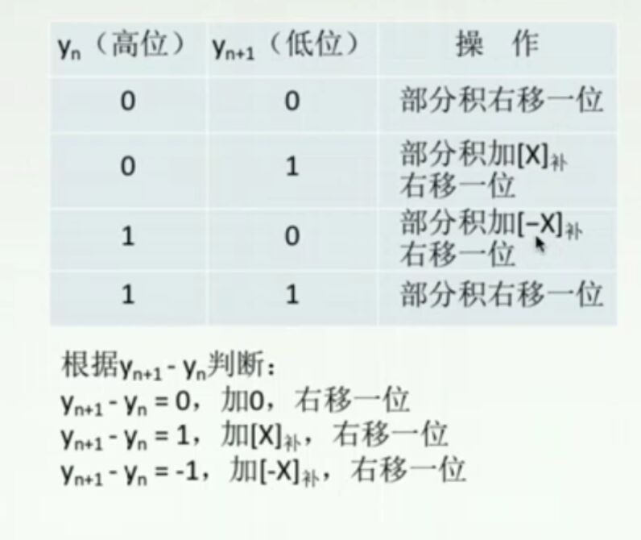

## 1.机器数(原码，反码，补码)
> 1. 原码：有符号，无符号 \
> 取值范围：\[-127,127\] (假设为8位) \
>
>>二进制小数转化：\
> 小数部分乘2，取整数部分，直到小数部分为0，分别得到小数点后第1,2,3...位
>
>
> 2. 反码：正数的反码就是原码，负数的反码是原码除符号位所有位取反，取值范围与原码相同
> 3. 补码：正数就是原码，负数是反码+1，取值范围：\[-128,127\] 计算机里面数是用补码存的

### 例子：

>按照 原码，反码，补码 的顺序,按8位
1. [-1]：\
10000001 \
11111110 \
11111111 

2. [+1] \
00000001 \
00000001 \
00000001

3. [-5] \
10000101 \
11111010 \
11111011

## 2. 校验码
> 1. 奇偶校验码 \
Example: \
原始数据为：1000110 \
含有3个1，如果用奇校验，前面添0，添完后1总数为奇数个；同理，如果偶校验，前面添1，添完后1的总数为偶数个  So easy~~

> 2. 海明校验码： \
> 原理：在第2^i:\[0,k\]位上添加校验位，满足2^k>=k+n+1 \
> Example: \
> 原始数据为:D10D9D8...D1为 1010010001 (10位数) \
> 需要添加4位校验位：1,2,4,8 \
> 得到的结果为H15H14H13...H2H1为：\
> 101001x000x1xx 其中校验位先用x代替 \
> 然后求校验位
> > > 校验位的求法： 
> >
> > 数据位占的位数为3,5,6,7,9,10,11,12,13,14, 也就是0011,0101,0110,0111,1001,1010,1011,1100,1101,1110 \
> > 然后取每一个第i位为1的 **真实数值**，做异或运算，其实可以看做是偶校验，添0还是添1的问题，结果就是xi的值，即校验位 \
> > 比如 求x1，第一位为1的有第0011,0101,0111,1001,1011,1101 即 3,5,7,9,11,13,即D1,D2,D4,D5,D7,D9,分别为:1,0,0,1,0,0,显然，校验位为0，即x1=0，同理x2,x3,x4也如此
> 
> 然后是校验
> 
> > 假设收到一个字符串，可能某一位出错，然后求出S1,S2,S3,S4,其中S1 = x1,D1,D2,D4,D5,D7,D9取异或，也就是偶校验，同理S2,S3,S4，然后出错的那一位即是S4 S3 S2 S1 ,比如是1001，就是第9位错了，纠错只需要将第9位取反

> CRC校验码：
> 通过生成多项式生成校验码 /
> > Example: \
> 生成多项式为G(x) = x^3+x^2+1,对应的二进制码为1101，最高次幂为3，求对信息10110的校验码 \
> 步骤1. 将信息码左移3位，3为生成多项式的最高次幂，然后用生成多项式的二进制码作为除数，进行模2除运算，即没有借位，只是异或，除到最后得到的三位余数即为校验位，添加到原始信息的后面 \
> 步骤2.检验：同样也是用生成的校验码和生成多项式进行模2除，余数为0即正确，否则就是余数的那位错了，如余数为010，就是第2位错

## 定点数运算
> 1. [A+B]补 = [A]补 + [B]补
> 2. [-A]补 = [A]补 连同符号位取反加1 

3. 原码乘法 \
> 1. 原码一位乘法
[An Example](原码一位乘法.jpg)
> 2. 补码一位乘法(Booth乘法)
 \
[An Example](88.png)